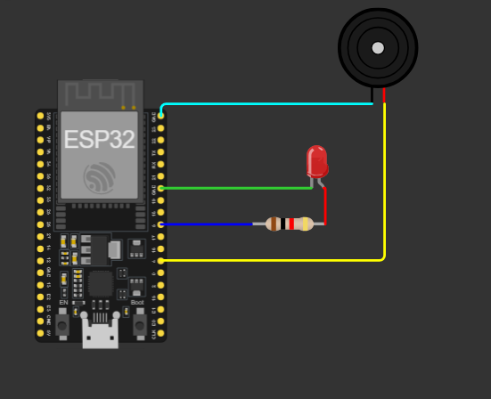

# 🐾 Rastreador IoT para Animais de Estimação (ESP32)

> Protótipo de coleira para monitorização, localização e alertas de fuga para felinos utilizando o microcontrolador ESP32, integração Wi-Fi, servidor de notificações push e atuadores locais.

---

## 📌 Visão Geral do Sistema

O sistema opera identificando a presença do Wi-Fi doméstico como uma **Zona Segura**. Caso o animal se afaste do alcance da rede, o dispositivo regista a falha de conexão na memória não volátil (NVS) para evitar falsos alarmes. Após 3 falhas consecutivas, o sistema confirma o estado de fuga e aciona simultaneamente:
1. **Notificação Push:** Envio de mensagem instantânea via **Ntfy.sh** para o smartphone do tutor.
2. **Alertas Locais:** Acionamento de um **LED pisca-pisca** (GPIO 5) e um **Buzzer sonoro** (GPIO 4) para auxiliar na busca visual e auditiva.
3. **Beacon Bluetooth (BLE):** Ativação do sinal de rádio `Gato_Rastreador_SOS` para estimativa de proximidade no perímetro.

---

## 🛠️ Hardware e Circuito Virtual (Wokwi)



| Componente | Pino GPIO (ESP32) | Função / Descrição |
| :--- | :---: | :--- |
| **ESP32-DevKitC-V4** | — | Microcontrolador Principal |
| **LED Vermelho** | `GPIO 5` | Indicador Luminoso de Emergência (com resistor de 1kΩ) |
| **Buzzer Piezoelétrico** | `GPIO 4` | Alarme Sonoro Intermitente |
| **Memória NVS** | Interna | Persistência do contador de falhas (`Preferences.h`) |

---

## 🚦 Status do Projeto (Scrum / Kanban)

A gestão do desenvolvimento é acompanhada no **GitHub Projects** utilizando User Stories (US):

* [x] **`US01` - Monitoração de Zona Segura (Wi-Fi):** Validação de presença na rede doméstica.
* [x] **`US02` - Tolerância de 3 Falhas:** Regra de validação em memória NVS contra falsos alarmes.
* [x] **`US03` - Notificação Push (Ntfy.sh):** Disparo de alertas em tempo real no smartphone.
* [x] **`US05` - Alerta Sonoro e Luminoso:** Acionamento sincronizado de Buzzer e LED.
* [ ] **`US04` - Radar de Busca Bluetooth (BLE):** Transmissão do Beacon em modo de emergência *(Pronto para teste)*.
* [ ] **`US06` - Portal Cativo de Configuração (WiFiManager):** Interface web para troca de senha Wi-Fi *(Aguardando hardware físico)*.
* [ ] **`US07` - Case de Proteção e Alimentação:** Envolvente mecânico e gestão por bateria *(Aguardando montagem física)*.

---

## 💻 Código de Teste Validado (`sketch.ino`)

```cpp
#include <WiFi.h>
#include <HTTPClient.h>
#include <Preferences.h>
#include <BLEDevice.h>
#include <BLEUtils.h>
#include <BLEServer.h>

// Pinos dos Atuadores
const int PIN_BUZZER = 4;
const int PIN_LED = 5;

// Rede Wi-Fi (Altere para "REDE_INEXISTENTE" para simular a fuga)
const char* ssid = "Wokwi-GUEST";
const char* password = "";

// Tópico para o Alerta Push (Ntfy.sh)
const char* ntfy_topic = "gato_rastreador_alerta_123"; 

Preferences preferences;
int contadorFalhas = 0;
bool bleAtivo = false;

void inicializarRadarBLE() {
  if (!bleAtivo) {
    Serial.println("\n[BLE] Inicializando Beacon Bluetooth Low Energy...");
    BLEDevice::init("Gato_Rastreador_SOS");
    
    BLEServer *pServer = BLEDevice::createServer();
    BLEAdvertising *pAdvertising = BLEDevice::getAdvertising();
    pAdvertising->addServiceUUID("12345678-1234-1234-1234-123456789abc");
    pAdvertising->setScanResponse(true);
    
    BLEDevice::startAdvertising();
    bleAtivo = true;
    Serial.println("[BLE] Radar ativado! Transmitindo sinal 'Gato_Rastreador_SOS'...");
  }
}

void enviarNotificacaoNtfy() {
  if (WiFi.status() == WL_CONNECTED) {
    HTTPClient http;
    String url = "[https://ntfy.sh/](https://ntfy.sh/)" + String(ntfy_topic);
    http.begin(url);
    http.addHeader("Content-Type", "text/plain");
    int httpResponseCode = http.POST("ALERTA: O gato saiu da zona segura!");
    
    if (httpResponseCode > 0) {
      Serial.println("[Ntfy] Notificação Push enviada com sucesso!");
    } else {
      Serial.printf("[Ntfy] Erro ao enviar: %d\n", httpResponseCode);
    }
    http.end();
  }
}

void iniciarModoDeFuga() {
  Serial.println("\n======================================");
  Serial.println("!!! MODO DE FUGA CONFIRMADO (3/3) !!!");
  Serial.println("======================================");
  
  inicializarRadarBLE();
  enviarNotificacaoNtfy();
  
  Serial.println("[Atuadores] Acionando Buzzer e LED intermitente...");
  for (int i = 0; i < 10; i++) {
    digitalWrite(PIN_LED, HIGH);
    digitalWrite(PIN_BUZZER, HIGH);
    delay(300);
    digitalWrite(PIN_LED, LOW);
    digitalWrite(PIN_BUZZER, LOW);
    delay(300);
  }
}

void setup() {
  Serial.begin(115200);
  pinMode(PIN_BUZZER, OUTPUT);
  pinMode(PIN_LED, OUTPUT);
  
  digitalWrite(PIN_BUZZER, LOW);
  digitalWrite(PIN_LED, LOW);

  preferences.begin("gato_tracker", false);
  contadorFalhas = preferences.getInt("falhas", 0);
  preferences.end();

  Serial.println("\n[Sistema] Rastreador Iniciado...");
}

void loop() {
  Serial.println("\n[Wi-Fi] Checando Zona Segura...");
  
  if (WiFi.status() != WL_CONNECTED) {
    WiFi.begin(ssid, password);
    int tentativas = 0;
    while (WiFi.status() != WL_CONNECTED && tentativas < 5) {
      delay(500);
      Serial.print(".");
      tentativas++;
    }
  }

  if (WiFi.status() == WL_CONNECTED) {
    Serial.println("\n[OK] Conectado à Zona Segura! O gato está em casa.");
    contadorFalhas = 0;
    
    preferences.begin("gato_tracker", false);
    preferences.putInt("falhas", 0);
    preferences.end();
  } else {
    contadorFalhas++;
    
    preferences.begin("gato_tracker", false);
    preferences.putInt("falhas", contadorFalhas);
    preferences.end();
    
    Serial.printf("\n[FALHA] Falha %d/3 na localização da Zona Segura.\n", contadorFalhas);

    if (contadorFalhas >= 3) {
      iniciarModoDeFuga();
    }
  }

  delay(5000); 
}
